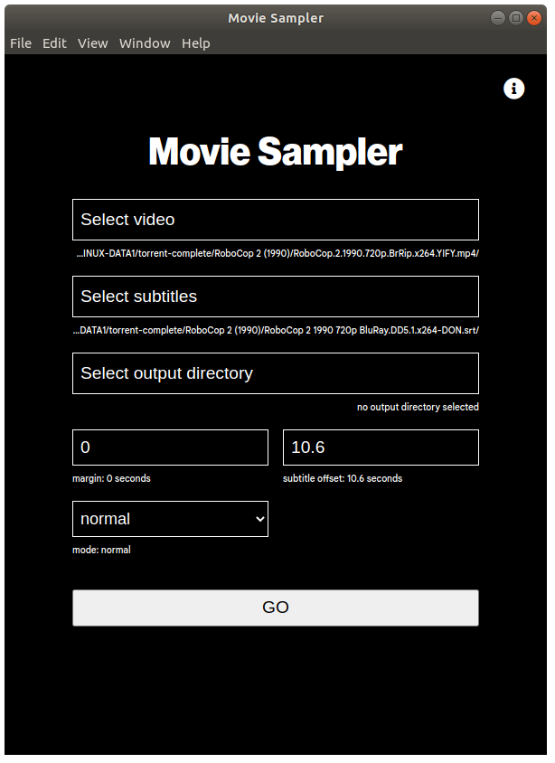

# Movie Sampler Electron

Movie Sampler extracts sound effects from movies based on subtitle files
that have noise captions. It just samples the movie audio whenever the
subtitles say something in square brackets, parentheses or all caps like
[alarm beeping] or (agonized grunts) or INDISTINCT CHATTER.



## Releases

Check out the [releases section](https://github.com/luukschipperheyn/movie-sampler-electron/releases/) if you want a compiled version for Windows or macos

## Development

### npm

```bash
npm install
```

### yarn

```bash
yarn install
```

## Usage

running

```python
yarn start
```

building

```python
yarn make
```

## Contributing

Pull requests are welcome. For major changes, please open an issue first to discuss what you would like to change.

Please make sure to update tests as appropriate.

## License

[MIT](https://choosealicense.com/licenses/mit/)
